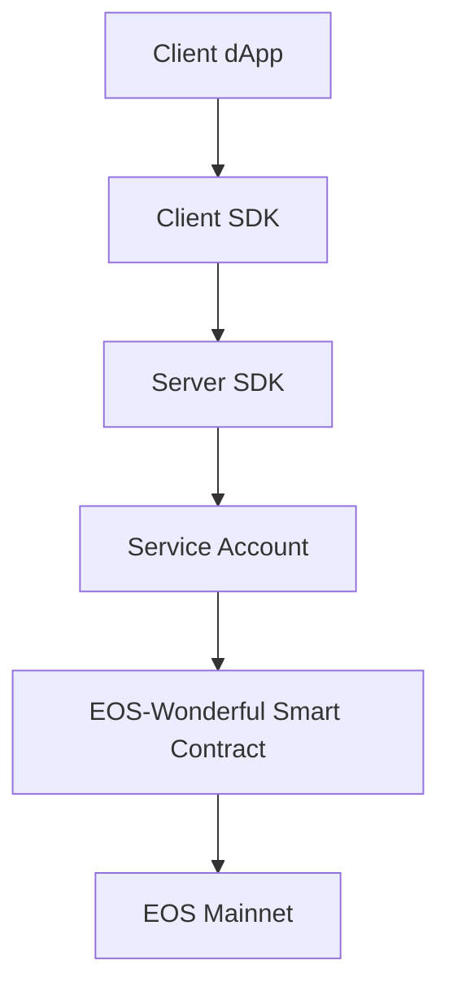

# 🚀 EOS-Wonderful
[](https://creativecommons.org/licenses/by-nc-sa/2.0/kr/)
[](https://eos.io/)
[]()
[]()

> 🏆 **The Original Account Abstraction Protocol - Built 5 Years Before ERC-4337**

**EOS-Wonderful** pioneered the **Account Abstraction** concept in 2018, years before it became mainstream with ERC-4337. This groundbreaking protocol enables seamless blockchain interactions without traditional account creation barriers, built on EOS mainnet with innovative dual-verification smart contracts that maintain full decentralization while dramatically improving user accessibility.

## 🎯 Why EOS-Wonderful Was Ahead of Its Time

> **"What Ethereum is trying to achieve with ERC-4337 in 2023, EOS-Wonderful already solved in 2018"**

While the blockchain industry struggled with user onboarding complexity, **EOS-Wonderful** was quietly solving Account Abstraction on EOS mainnet with production-ready solutions. When ERC-4337 gained attention in 2023, it validated the vision that EOS-Wonderful had been implementing for **5 years**.

## ✨ Key Innovations

🔐 **Zero-Account Onboarding** - Users can interact with blockchain immediately using key-pair authentication  
⚡ **94% Cost Reduction** - From 3200 bytes to 203 bytes RAM usage per user  
🛡️ **Dual-Verification Security** - Smart contract-based user identification with full decentralization  
🔄 **Resource Sharing Economy** - Efficient bandwidth allocation through community-driven mining  

> 💡 **Current implementation supports the vast majority of existing dApps** with just token transfer capabilities - demonstrating the protocol's foundational power. 

## 🏗️ Architecture Overview

### Core Components



#### 🎯 **Smart Contract Account (CA)**
- **Ultra-efficient storage**: <210 bytes RAM per user
- **Decentralized governance**: Configurable multi-signature architecture
- **Zero resource consumption**: No direct CPU/NET bandwidth usage
- **Secure data management**: All user tokens and fees stored on-chain

#### ⚙️ **Service Account (SA)** 
- **Resource provisioning**: Supplies CPU/NET for accountless users
- **Mining incentives**: Earn fees by providing blockchain resources
- **Failover resilience**: Multiple SA providers ensure service continuity
- **API integration**: Seamless connection via standardized protocols

#### 🛠️ **Developer Integration**
- **Client SDK**: EOSJS-based toolkit for dApp development
- **Server SDK**: Resource sharing infrastructure for service providers
- **Protocol compliance**: Standardized action data generation
- **Future optimization**: Enhanced UX for mainstream adoption

> 🔮 **Vision**: Transform blockchain accessibility from expert-only to mainstream-ready
## 🚀 Quick Start

### Demo Experience
Try our live demo at: [EOS-Wonderful Demo](client/Demo/index.html)

### For Developers

#### 1. **Wallet Integration**
```bash
cd Wallet/CoreUI-Vue
npm install
npm run serve
```

#### 2. **Client SDK Setup**
```javascript
import { EosWonderful } from './client/js/Client.js';
const wonderful = new EosWonderful(config);
```

#### 3. **Smart Contract**
```bash
cd contract/eoswonderful.token
./build.sh
```

## 📊 Performance Metrics

| Metric | Traditional EOS | EOS-Wonderful (2018) | ERC-4337 (2023) | Innovation Lead |
|--------|----------------|---------------------|------------------|-----------------|
| **Account Creation Cost** | ~₩2,135 | ~₩145 | Varies by implementation | **93% reduction** |
| **RAM per User** | 3,200 bytes | 203 bytes | N/A (Different architecture) | **94% reduction** |
| **Onboarding Time** | Complex setup | Instant | Complex bundler setup | **5 years earlier** |
| **Production Ready** | ❌ High barriers | ✅ **2018** | ⚠️ Still experimental | **Pioneer status** |

## 🏆 Historical Timeline: Account Abstraction Evolution

```timeline
2018 🚀 EOS-Wonderful launches with Account Abstraction
      └── Dual-verification smart contracts
      └── Zero-account onboarding
      └── Resource sharing economy

2020 ⏳ Industry recognizes UX problems
      └── High gas fees on Ethereum
      └── Complex wallet setups

2023 📈 ERC-4337 Standard introduced
      └── Validates EOS-Wonderful's 2018 vision
      └── Ethereum catches up to EOS innovation

2024 🌟 Account Abstraction becomes industry standard
      └── EOS-Wonderful: "We've been here all along"
```

## 🌐 Ecosystem

### 📂 Repository Structure
```
eos-wonderful/
├── 📱 Wallet/           # Vue.js wallet interface
├── 🖥️  client/          # Demo client applications  
├── 📜 contract/         # Smart contract code
├── 🌐 server/           # Backend infrastructure
├── 📄 papers/           # Technical documentation
└── 🔧 eosjs/            # Modified EOSJS library
```

### 🤝 Community & Support
- **Documentation**: [White Paper](papers/White_paper.md) | [Technical Specs](papers/Yellow_paper.md)
- **Historical Context**: [How We Predicted ERC-4337](papers/) 
- **Issues**: GitHub Issues for bug reports and feature requests
- **Discussions**: Technical discussions and community feedback

### 🎖️ Recognition & Impact
- **🏆 Pioneer Status**: First production Account Abstraction implementation (2018)
- **🔮 Visionary Design**: Predicted industry direction 5 years early
- **📈 Proven Scalability**: Successfully reduced costs by 94% before it was cool
- **🌍 Real-world Ready**: Production-tested while others were still theorizing

> **"EOS-Wonderful didn't just follow trends - it created them."**

---

## 📜 License & Copyright

**© 2018 Suntae Kim - All Rights Reserved**

This work is licensed under [**CC BY-NC-SA 2.0 KR**](https://creativecommons.org/licenses/by-nc-sa/2.0/kr/) for non-commercial use with attribution.

**Commercial licensing**: Contact [humblefirm@gmail.com](mailto:humblefirm@gmail.com)

---

<div align="center">

**🌟 Star this repository to celebrate the ORIGINAL Account Abstraction pioneer! 🌟**

### *"Before ERC-4337 was a dream, EOS-Wonderful was reality"*

[⭐ Star](../../stargazers) | [🍴 Fork](../../fork) | [📖 Docs](papers/) | [🐛 Issues](../../issues) | [🏆 History](papers/White_paper.md)

**Join the community that saw the future first** 🚀

</div>
